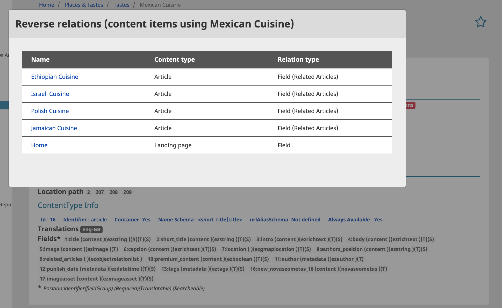

# Content Quick Info

Sometimes site administrators need a quick overview about all meta content information. That means they have to click the several tabs in the content view and check the ContentType information from the admin panel. How many clicks you have to do? how many browser tabs you need to open? What should you do to see all fieldtypes identifiers and positions? What about Visibility,: it is `content` or `location` hidden or maybe hidden from the `parent`??

This example shows you a simple integration in the ezplatform admin UI. In the content view you will see all information in one collapsible panel (per defaut open). It helps you to get the most important information about the content: `Content info`, `Location info` and `ContentType info` without leaving it.

## Screenshots:

Several Visibility status?

## Implementation

This implementation extend the `page_title.html.twig` template coming with the eZ Platform Admin UI Bundle. Only one line is added at the end of the original template.

[{{ include('@ezdesign/parts/content_info.html.twig') }}](https://github.com/arfaram/ezeventdemo/blob/more_example/Resources/views/themes/admin/parts/page_title.html.twig#L27)

Yes!, it is Siteaccess (Multisite) aware. That means you can have a set of specific information or design for each backend.

The [content_info.html.twig Template](https://github.com/arfaram/ezeventdemo/blob/more_example/Resources/views/themes/admin/parts/content_info.html.twig) is using a Symfony Twig extension to gather all needed information for you. You can find the function exactly [here](https://github.com/arfaram/ezeventdemo/blob/more_example/Twig/ContentCollectionDataset.php#L60)

Awesome! only 5 php line codes to get all information!

About the template: `content_info.html.twig Template` it is a bulk bootstrap 4 html code. It is documented and up to you to customize it or add some includes ;)

Before I forget! There is a pop-up modal when you click on `content has relation` or `content has inverse relation`. I mean the blue or red buttons, what is the original aim of this implementation, to add a visual warning for editors before deleting the content :)

Enjoy!

Of course, don't forget to register the [Extension](https://github.com/arfaram/ezeventdemo/blob/more_example/Resources/config/services.yml#L19) 
